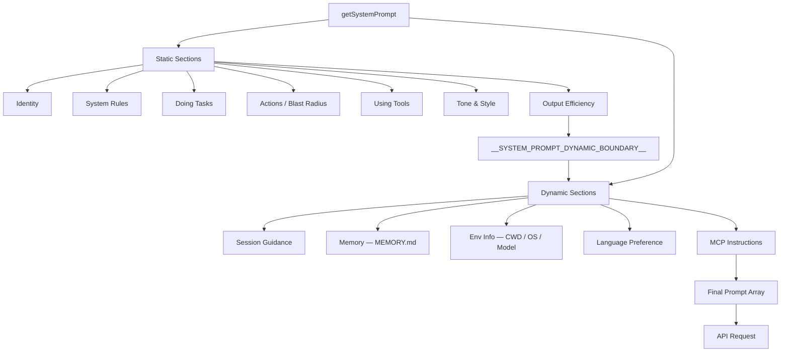
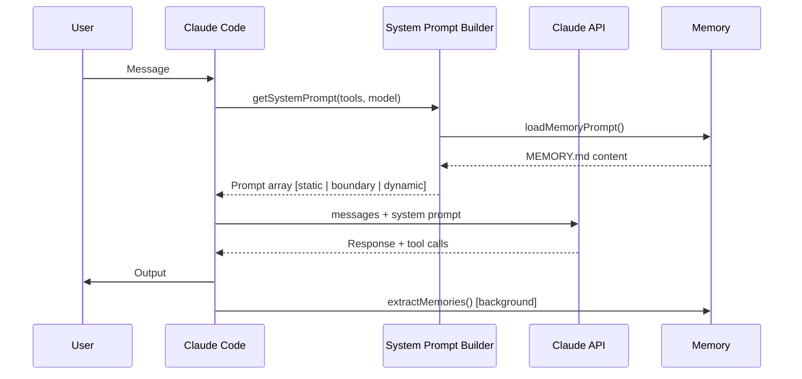
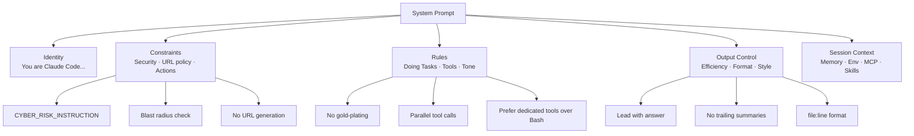
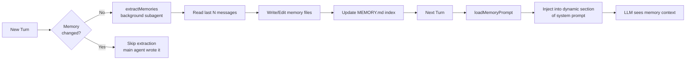
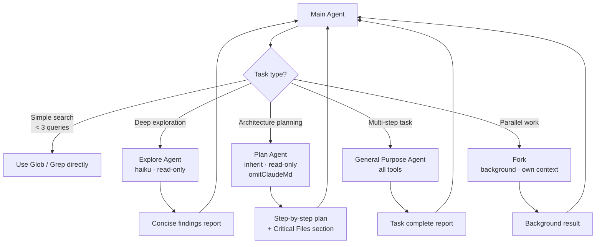

# System Prompt Diagrams

---

## 1. System Prompt Assembly Flow

```mermaid
flowchart TD
    A[getSystemPrompt] --> B[Static Sections]
    A --> C[Dynamic Sections]

    B --> B1[Identity]
    B --> B2[System Rules]
    B --> B3[Doing Tasks]
    B --> B4[Actions / Blast Radius]
    B --> B5[Using Tools]
    B --> B6[Tone & Style]
    B --> B7[Output Efficiency]

    B7 --> BOUNDARY[__SYSTEM_PROMPT_DYNAMIC_BOUNDARY__]

    BOUNDARY --> C
    C --> C1[Session Guidance]
    C --> C2[Memory — MEMORY.md]
    C --> C3[Env Info — CWD / OS / Model]
    C --> C4[Language Preference]
    C --> C5[MCP Instructions]

    C5 --> D[Final Prompt Array]
    D --> E[API Request]
```

---

## 2. Request Flow

```mermaid
sequenceDiagram
    participant U as User
    participant CC as Claude Code
    participant SP as System Prompt Builder
    participant LLM as Claude API
    participant M as Memory

    U->>CC: Message
    CC->>SP: getSystemPrompt(tools, model)
    SP->>M: loadMemoryPrompt()
    M-->>SP: MEMORY.md content
    SP-->>CC: Prompt array [static | boundary | dynamic]
    CC->>LLM: messages + system prompt
    LLM-->>CC: Response + tool calls
    CC->>U: Output
    CC->>M: extractMemories() [background]
```

---

## 3. Prompt Structure Hierarchy

```mermaid
graph TD
    ROOT[System Prompt] --> ID[Identity\nYou are Claude Code...]
    ROOT --> CNST[Constraints\nSecurity · URL policy · Actions]
    ROOT --> RULES[Rules\nDoing Tasks · Tools · Tone]
    ROOT --> OUTPUT[Output Control\nEfficiency · Format · Style]
    ROOT --> CTX[Session Context\nMemory · Env · MCP · Skills]

    CNST --> C1[CYBER_RISK_INSTRUCTION]
    CNST --> C2[Blast radius check]
    CNST --> C3[No URL generation]

    RULES --> R1[No gold-plating]
    RULES --> R2[Parallel tool calls]
    RULES --> R3[Prefer dedicated tools over Bash]

    OUTPUT --> O1[Lead with answer]
    OUTPUT --> O2[No trailing summaries]
    OUTPUT --> O3[file:line format]
```

---

## 4. Memory Integration

```mermaid
flowchart LR
    TURN[New Turn] --> CHECK{Memory\nchanged?}
    CHECK -- No --> EXTRACT[extractMemories\nbackground subagent]
    CHECK -- Yes --> SKIP[Skip extraction\nmain agent wrote it]

    EXTRACT --> READ[Read last N messages]
    READ --> WRITE[Write/Edit memory files]
    WRITE --> INDEX[Update MEMORY.md index]

    INDEX --> NEXT[Next Turn]
    NEXT --> LOAD[loadMemoryPrompt]
    LOAD --> INJECT[Inject into dynamic section\nof system prompt]
    INJECT --> LLM[LLM sees memory context]
```

---

## 5. Subagent Routing

```mermaid
flowchart TD
    MAIN[Main Agent] --> NEED{Task type?}

    NEED -- Simple search\n< 3 queries --> DIRECT[Use Glob / Grep directly]
    NEED -- Deep exploration --> EXPLORE[Explore Agent\nhaiku · read-only]
    NEED -- Architecture planning --> PLAN[Plan Agent\ninherit · read-only\nomitClaudeMd]
    NEED -- Multi-step task --> GENERAL[General Purpose Agent\nall tools]
    NEED -- Parallel work --> FORK[Fork\nbackground · own context]

    EXPLORE --> REPORT[Concise findings report]
    PLAN --> PLANOUT[Step-by-step plan\n+ Critical Files section]
    GENERAL --> GENOUT[Task complete report]
    FORK --> FORKOUT[Background result]

    REPORT --> MAIN
    PLANOUT --> MAIN
    GENOUT --> MAIN
    FORKOUT --> MAIN
```
